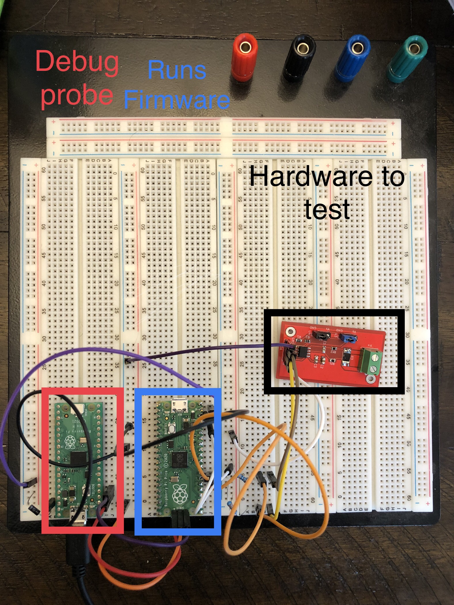
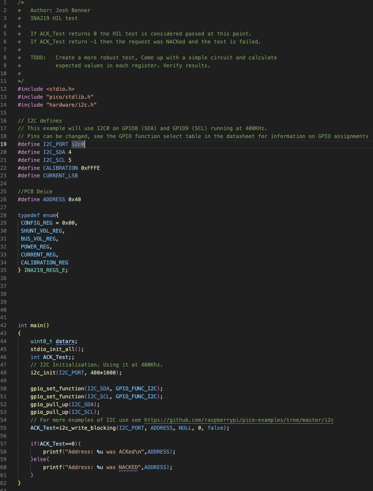

# Lab Entry – 2026-01-11

## Metadata
- Date: 2026-01-11
- Project: Offgrid solar battery charger
- Board / Rev:
- Scope: HIL Test INA219 Breakout board

## Objective
 Verify that the INA219 Breakout Board works by seeing if it ACKS a request to write to it. 
## Setup
<figure>
  
  <figcaption>Figure 1: HIL Setup</figcaption>
</figure>

We will use the i2c api provided by Raspberry pi to write to the hardware to be tested. The specific function used will be i2c_write_blocking, which returns the number of bytes written, or PICO_ERROR_GENERIC if address not acknowledged, no device present. 

We set the addrees of the PCB to be 0x40 (A0 and A1 = GND). 

If the INA219 PCB is working as expected, we should see i2c_write_blocking return a 0 (this is equivalent to ACKing a write request of 0 bytes). 

<figure>
  
  <figcaption>Figure 2: Firmware Runing The Test</figcaption>
</figure>

## Observations
<figure>
  
  <figcaption>Figure 3: Test Result</figcaption>
</figure>

Figure 3 is a snap shot of the debug process of running the firmware test. We have a breakpoint set right after ACK_Test has been assigned by i2c_write_blocking function. If we look at the yellow box at the top left corn, it shows that ACK_Test reult is 0 and thus the INA219 PCB acknowleged the request to write 0 bytes to it. Therefore This pcb has passed this simple test. 
## Next Steps
Provide a more robust test. Use a 9 V battery and 100 ohm resistor. Calculate expected values in registers and then compare the expected result to the actual result. Considere error tollerances and if the results are within reason, the PCB will be considered functional. 