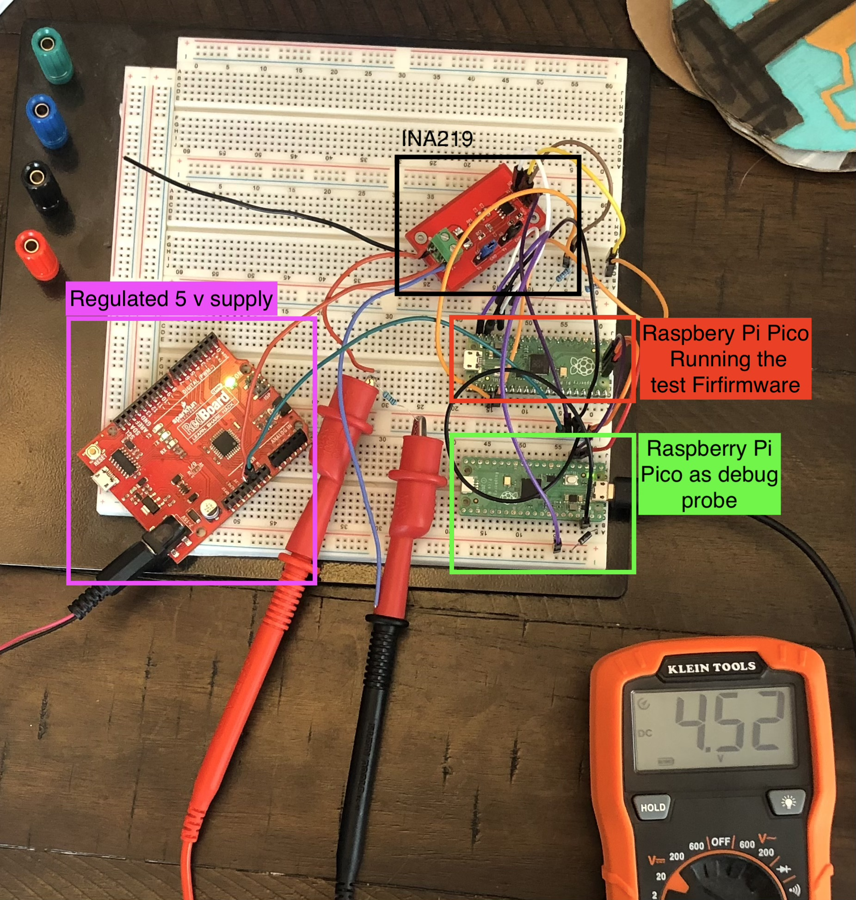
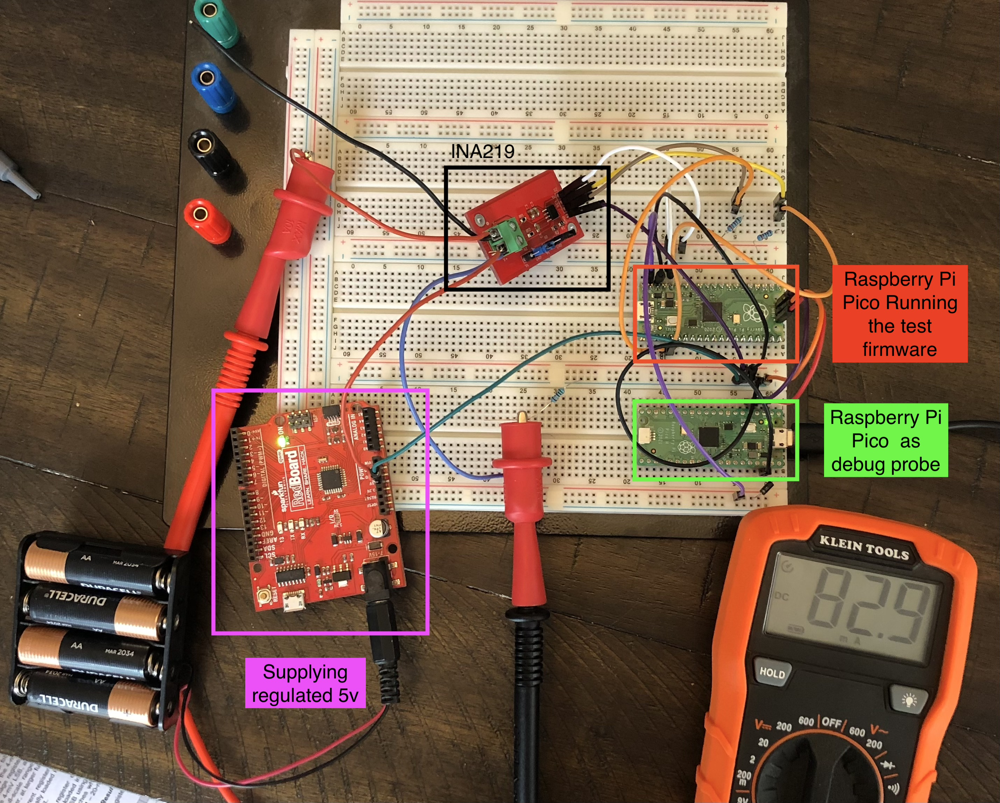

# Lab Entry – 2026-01-14

## Metadata
- Date: 2026-01-14
- Project: Off Grid Solar Battery Charger 
- Board / Rev:
- Scope: HIL test INA219. write to config register, read bus voltage reg and current reg. 

## Objective
Verify that the INA219 operates as expected. I found a few issues with my previous HIL test, so I made a more robust test. 

Verify that we can calibrate the INA219 by writing to the calibration register.
Verify that we can read the current register and it is what we expected. 
Verify that we can read the bus voltage and verify that it is what we expected. 

## Setup
## Setup
<figure>
  
  <figcaption>Figure 1: HIL Setup for Bus Voltage Verification</figcaption>
</figure>

<figure>
  
  <figcaption>Figure 2: HIL Setup for Current measurement Verification</figcaption>
</figure>

<figure>
  
  <figcaption>Figure 3: Software for running the Voltage Bus HIL test</figcaption>
</figure>
<figure>
  
  <figcaption>Figure 4: Software for running the Current measurment HIL test</figcaption>
</figure>

Note: I set the intial calibration register to 0xFFE. I then measured the acutal current and adjust the calibration register using the following equation from the INA219 data sheet. 

Corrected_Full_Scale_Cal = trunc((Cal*MeasuredShuntCurrent)/INA219_Current)
which ended up being = 0x0E50

## Measurements & Observations

If we look at the mulitimeter in Figure 1, we can see that the measured bus voltage is 4.52 V. If we look at Figure 3, we see that the Datarx_BusVoltage contains 0x23FA. 

According to the INA219 data sheet to convert Vbus into raw reading, we perform a shift left by 3 bits and muliply by the LSB (4mV). Perfoming these steps below:

(0x23FA >> 3) * 4 = 0x11FC = 4,604 mV. 

Looking at Figure 2 we can see that the multimeter is reading 82.9 mA of current in the sytem. If we look at Figure 4, we can see that Datarx buffer contains 0x0056 which is 86 mA. 

The multimeter and the INA219 are slightly off. This could be do to not recalibrating before each test. 

## Conclusions / Next Steps
The INA219 is functional and has passed the HIL test.

The next step is to repeat the process for the second board. 