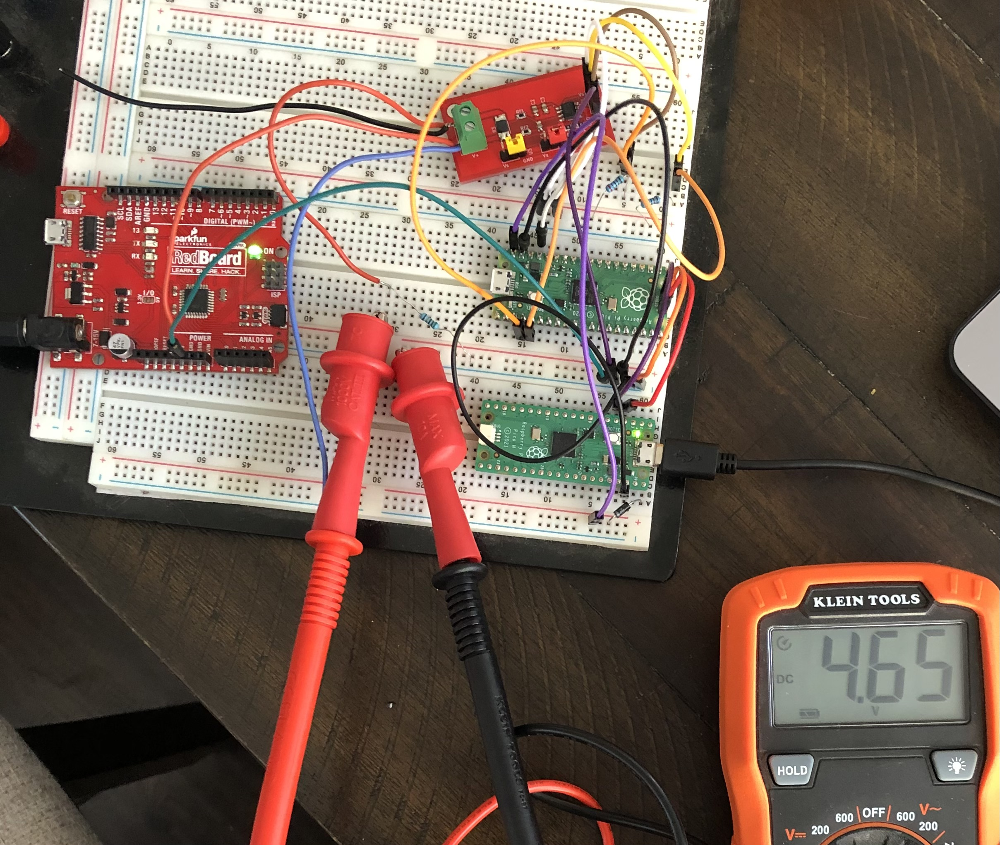
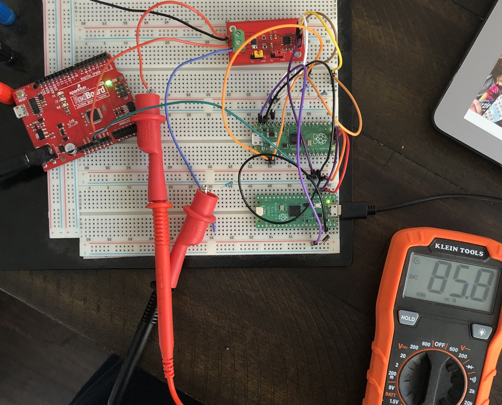
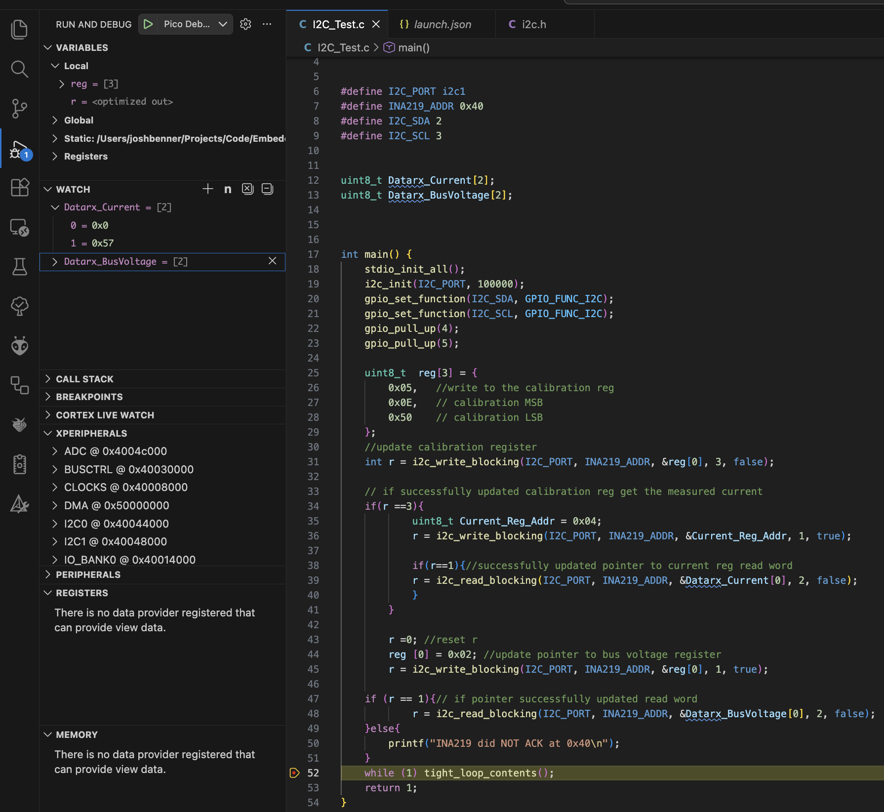

# Lab Entry – 2026-01-18

## Metadata
- Date: 2026-01-18
- Project: Off Grid Solar Battery Charger 
- Board / Rev: INA219 Breakout board #2
- Scope: Verify the functionality of the INA219 Breakout board

## Objective
Verify that we can write to the INA219 IC.
Verify that we can read bus voltage register.
Verify that we can read the Current register 

## Setup
<figure>
  
  <figcaption>Figure 1: HIL Setup for Bus Voltage Verification</figcaption>
</figure>
<figure>
  
  <figcaption>Figure 2: HIL Setup for Current Reg Verification</figcaption>
</figure>

<figure>
  
  <figcaption>Figure 3: Firmware Setup for Bus Voltage Verification</figcaption>
</figure>

<figure>
  
  <figcaption>Figure 4: Firmware Setup for Current Reg Verification</figcaption>
</figure>

## Measurements
Looking at Figure 1 we see that the multimeter measured 4.65 V on the bus. Looking at Figure 3 we can see that the values stored in Datarx_BusVoltage is 0x244A. Converting this into a voltage reading as defined in the datasheet we get:

(0x244A>>3)*4 = 4644 mV

Looking at Figure 2 we see that the multimeter reads a system current of 85.8 mA. Looking at Figure 4 we see that Datarx_Current holds 0x0057 which is 87 mA. 

## Observations
The multimeader readings and the INA219 IC reading were within reason. The current reading is a little more off due to the fact that when the current reading was made in the software vs when I took the picture of the system current, the numbers had already changed on the mulimeter. 

## Conclusions / Next Steps
Both INA219 Breakout boards have now passed the HIL test. 
My next step is to wrap up the control part of this project by now working on the gate drive circuit and PWM ouput from Raspbery Pi Pico. 

Step by step plan for the next two weeks: 
- Build the Gate Drive circuit and supply it with the regulated 5V output. 
- Develop software on the Raspberry pi pcio to output a pwm signal at 100 KHz and be able to adjust the duty cycle. 
- Hook up the gate drive circuit to the pico w pwm output. Use mulimeter to verify the voltage output is higher and changes with duty cycle than with just the pico (no gate drive). 