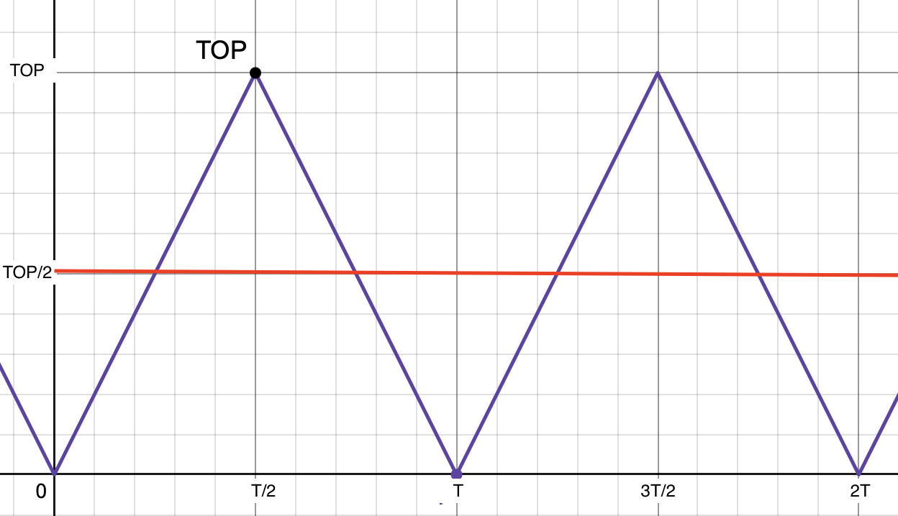

# Lab Entry – 2026-01-31

## Metadata
- Date: 2026-01-31
- Project: Off Grid Solar Battery Charger
- Board / Rev: Raspberry Pi Pico 1 
- Scope: Figure paramters and equations needed to test PWM on Pico 

## Objective
Determine the parameters needed to implemetn the PWM on the Raspberry Pi Pico and equations to set desired PWM output. 

## Setup
##### Pico Parameters:
- We Will use the pwm.h file provided by pico C SDK 
- System clock runs at 125 MHz. 
- Let TOP be the value we count up to.
- phase-correct mode for PWM generation: where the counter starts to count downward after reaching TOP, until it reaches 0 again
- pwm_clkdiv_mode = PWM_DIV_FREE_RUNNING, which means: Free-running counting at rate dictated by fractional divider.
- pwm_config_set_clkdiv() set the clock divider value
- Note: we choose free running mode because: If the divide mode is free-running, the PWM counter runs at clk_sys / div.
- pwm_set_counter() is used to set the duty cycle. 

##### Setting PWM Frequency:
NOTE: The PWM frequency is directly related to the TOP value. See Figure 1 for a quick visual reference. 

The PWM period, denoted TPWM in the phase phase-correct mode is:
\[
T_{PWM}= 2\times (TOP+1 )\times T_{clk}
\]

We can find a TOP value to generate 100 kHz signal by setting TPWM to 10µs, and solve for TOP (assuming clock is running at 125 MHz):

\[
    TOP+1 = \frac{T_{PWM}}{2*T_{clk}} = \frac{10*10^{-6}}{2*8*10^{-9}} = 625
\] 

> Therefore we will set clock divider(PWM_CLK_DIV) to 1, and TOP to 624.

##### Setting PWM Duty Cycle:
Let ***CounterCompareVal*** be the value that set the PWM duty cycle (red line in Figure 1). 

***"Duty"*** = decimal representation of desired duty cylce percentage (Duty will be a float data type). 

For the test, we will hardcode the Duty value we want. so 10% duty would be .1. 

to set the desired duty cycle:
>\[ CounterCompareVal = TOP \times Duty \]

Pass CounterCompareVal into the pwm_set_counter(). 

<figure>
  
  <figcaption>Figure 1: Visual of math used to set up PWM in phase corrected mode</figcaption>
</figure>

## Conclusions / Next Steps
| Variable Name| Data Type|Value to use| Description | Pass to function pwm.h|
|---|---|---|---|---|
| TOP| Uint_16t| 624 | parameter to set PWM Frequency|pwm_config_set_clkdiv()|
| PWM_CLK_DIV|uint_8t |1 |parameter to set PWM Frequency (how fast we count to TOP) |pwm_config_set_clkdiv()|
|CounterCompareVal| uint_8t|variable|compare value that sets pwm duty output|pwm_set_counter()|
|Duty| float|variable| parameter to set Duty cycle|N/A|

Use these values, equations and functions in test_pwm.c file to generate a pwm output. 

- GPIO can output 3.3V max, so at 50% we should expect to see 1.65 V. we can repeat this for multiple duty cycles. Use multimeter to verify this. 
- We dont have an o-scope, so to verify the frequency, we will send the PWM signal to another GPIO pin and set an interupt to occur on the rising edge of PWM. We will get the time stamp of this intterupt and store it and then wait for another event to occur. We can calcualte the period by subtracting the most recent time stamp from previous time stamp and then invert it to get the frequency. if this calculated frequency is reasonalby close to the desired frequency we will consider the test succssefull. 