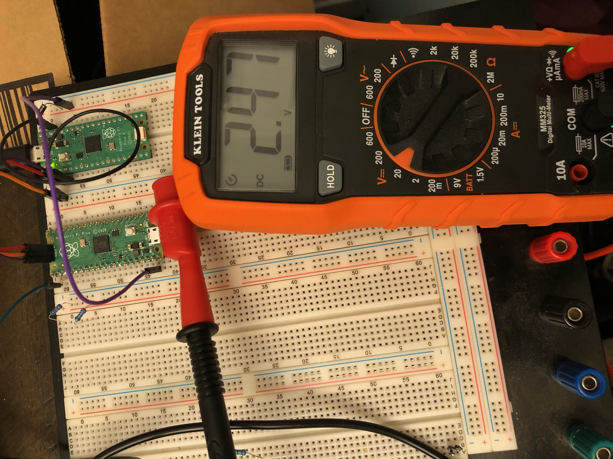
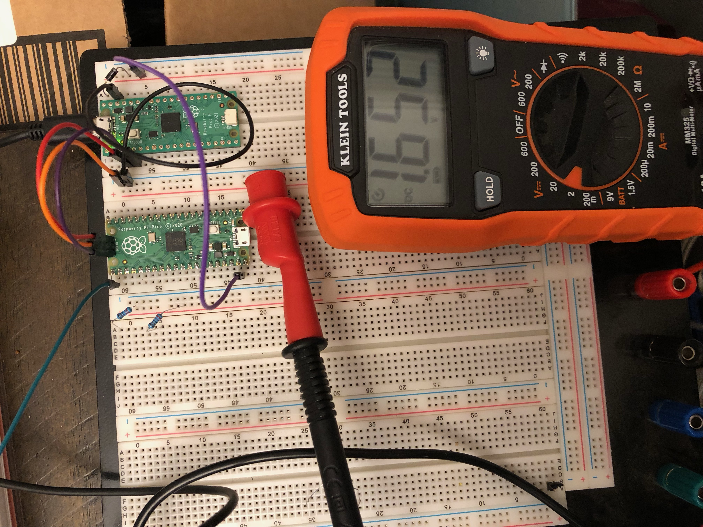

# Lab Entry – 2026-01-31

## Metadata
- Date: 2026-01-31
- Project: Off Grid Solar Battery Charger
- Board / Rev: Pico 1
- Scope: Setup the PWM software side. Measure output with Multimeter. Use intterupt on positive edge of PWM to calculate Frequency.

## Objective
Implement a 100 KHz frequency on the raspberry pi pico. 

## Setup
<figure>
  
  <figcaption>Figure 1: HIL Setup for 75% duty Cycle</figcaption>
</figure>
<figure>
  
  <figcaption>Figure 2: HIL Setup for 50% duty Cycle</figcaption>
</figure>

<figure>
  
  <figcaption> Figure 3: Software running the HIL Test- Verifies 100 Khz frequency     </figcaption>
</figure>

## Observations
Looking at Figure 1, we can see that the multimeter reads 2.47. The duty is set to 75%. We expect 3.3*.75= 2.475V. 

Looking at Figure 2, we can see that the multimeter is reading 1.652 V. The duty cycle is set to 50%, so we expect 3.3*.5= 1.65V. 

Looking at Figure 3, we see that the program is stoped on line 78, and Freq is 1000000.

## Conclusions / Next Steps
We have successfully verified the operation and control fo the pwm on the raspberry pi pico. We now need to set up the Gate drive circuit, and verify our pwm output works on that by using a multimeter. Verifying the frequency will require an oscope, due to running the gate drive circuit at a higher voltage than the pico can tolerate. 

