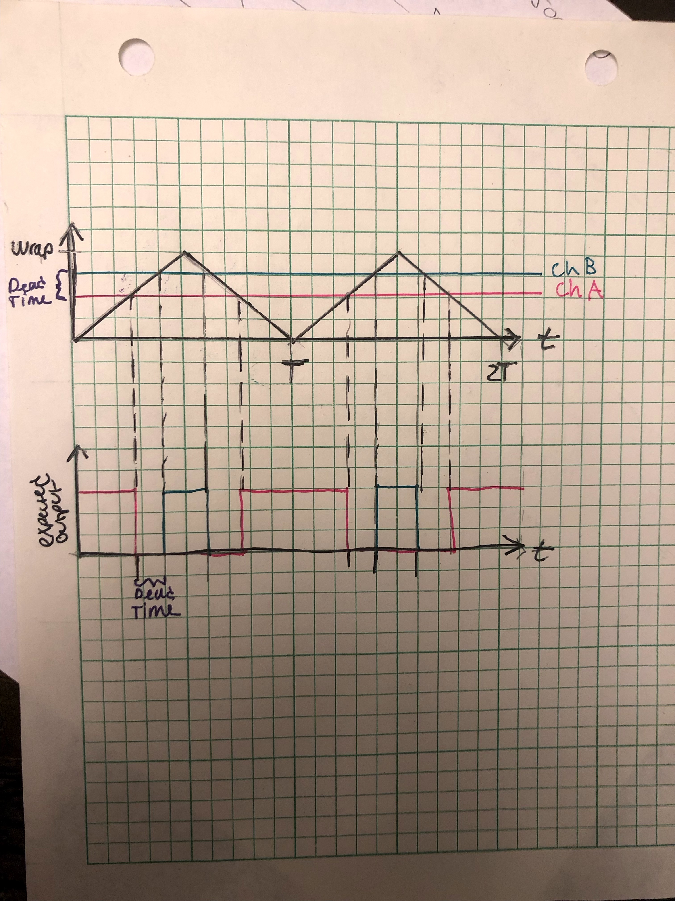

# Lab Entry – 2026-02-12

## Metadata
- Date: 2026-02-12
- Project: Off Grid Solar Battery Charger 
- Board / Rev: Raspberry Pi Pico 1
- Scope: Plan Software for Syncronous Buck Converter

## Objective
Proof of concept that both High side and low side mosfet will not turn on at the same time. 

## Setup
- **PWM Slices on RP2040 (Pico):**
  - There are 8 PWM slices (0–7).
  - Each slice has its own 16-bit counter.
  - The counter can count up, down, or up-down (phase-correct).
  - All outputs from the slice are synchronized to this counter.

- **Channels:**
  - Each slice has 2 channels: **A** and **B**.
  - Each channel controls one GPIO output.
  - Channels A and B **share the same counter**, so they stay in sync.

- **Key Consequences:**
  - Sharing the same counter allows **complementary PWM with dead-time**, ideal for half-bridge or synchronous buck converters.
  - Using different slices for high-side and low-side would make them **unsynchronized**, which is undesirable for synchronous switching.

- Let **Ch A be high Side** PWM signal and let **Ch B be low side** PWM signal. 
- Let mode be phase correct mode. 

<figure>
  
  <figcaption>Figure 1: Visual Representation of Goal in Software. Top Graph is visual of Phase corret mode to generate the lower graph PWM.</figcaption>
</figure>
Let level_A be the desired duty cycle (Pink line in figure 1) and level_B be the desired pwm for the low mosfet (Green line in figure 1). 

## Measurements
Using Figure 1 as our reference, it can be seen that:
- channel A and Channel B must have an offeset of what they compare to generate a PWM signal This offest is called dead time.
- Channel B must have opposite polarity than channel A. 

Let the system period be T_sys.
Let PWM period be T_PWM. 
Let dead time be T_dead. 

We can work backwards from the desired PWM graph desired dead time to get the count off set in the upper graph. This count offset Value(DEAD_TIME) can be found by:

DEAD_TIME = trunc(T_dead/T_sys) 

Therefore level_B= level_A+DEAD_TIME. 

Now that we have achieved our desired offset, we need to change Ch B's polarity. This is very simple if we use the Pico built in API PWM.h. We call the function: 

pwm_set_output_polarity(uint slice_num, bool a, bool b)

where both Ch A and Ch B share the same slice_num, bool a is false and bool b is true. 

Therefore Ch B now has the opposite polarity to Ch A.

## Conclusions / Next Steps
I left the calculation as generic as possible so that they can be tuned when testing and integrating the system. 

Next step is to implement this into the PWM_Test.c code and adjust T_dead, such that its as small as possible, yet does not allow any overlap when real world switching behaviors are at play. 

We will verify the two outputs on an o-scope and then attatch Ch A and Ch B to the gate drive circuit and verify that they still do not overlap. 

Next we will verify whether this new technique fixies the boostrap cap, such that we see a higher VGS measurement and the PWM signal does not have rolled edges. 
