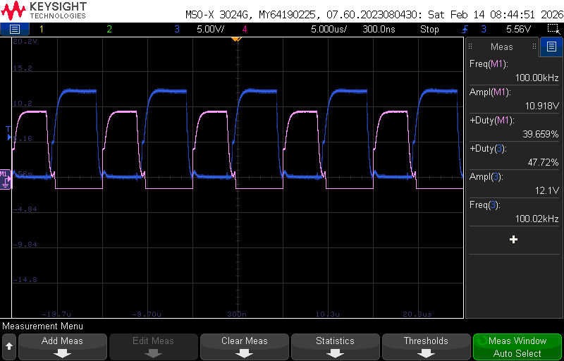
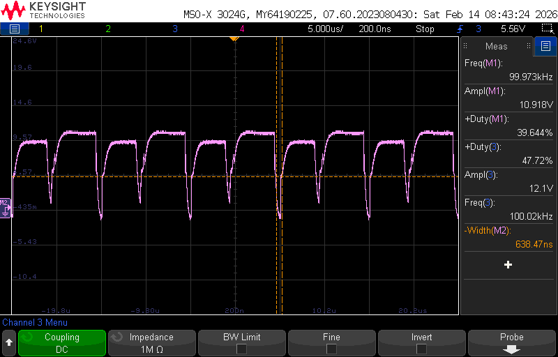

# Lab Entry – 2026-02-13

## Metadata
- Date: 2026-02-13
- Project: Off Grid Solar Battery Charger
- Board / Rev: Raspberry Pi Pico 1 
- Scope: Use High and low mosfets for the half bridge IC

## Objective
Verify that two mosfets work. 
Verify that we can achieve a VGS voltage higher than 4V
Try to get a better pwm output. 
## Setup
See [2-8-26-halfbridge-gatedriver-HIL-test](../2-8-26-halfbridge-gatedriver-HIL-test)
## Measurements

## Scope Captures
<figure>
  
  <figcaption>Figure 1: PWM VGS waveform. Pink is High side Mosfet. Blue is Lowside Mosfet.</figcaption>
</figure>

<figure>
  
  <figcaption>Figure 2: Add the two Waveforms from Figure 1. Measure the deadtime.</figcaption>
</figure>

## Observations
Looking at Figure 1, we can see that the highside mosfet still has rolled edges on the rising edge. 

We also see that we are getting a higher VGS ouput, thus achieving the 8 mohm resistance. 

Looking at Figure 2, we can see that we achieved a dead time of 638.47 ns. 

## Conclusions / Next Steps
This configuration works for most cases. However there are a few edge cases where the deadtmie is not
achieved and we would create shoot through. Because of this and the waveform rising edge not 
looking anybetter, I will switch back to asynchrounos buck converter and stick to high side switching only. 

Set up ADC on pico so we can achieve a fast current correction mode. Figure out resistor and shunt values to 
measure current and voltage out of the buck converter. 
