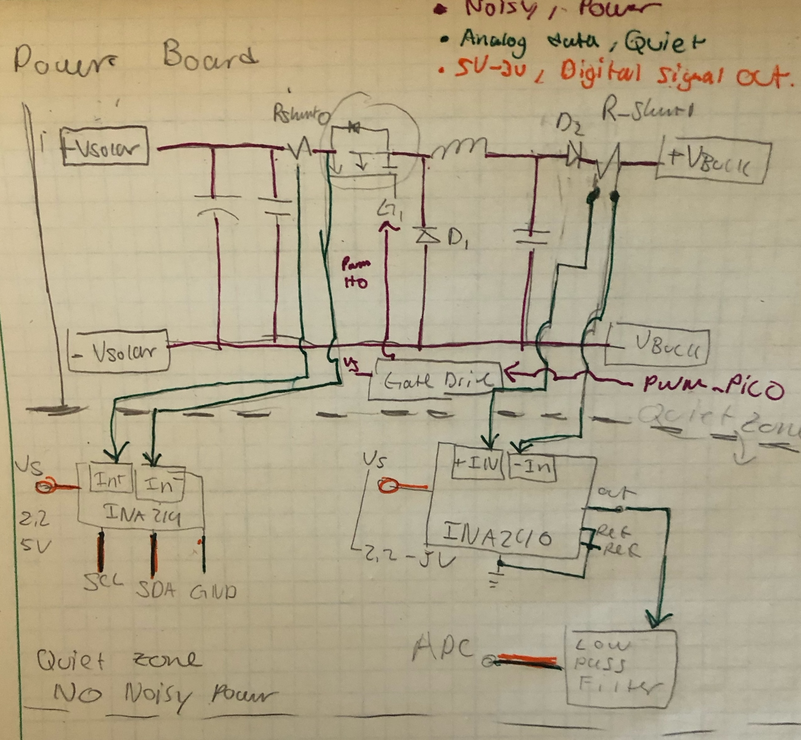

# Lab Entry – 2026-02-21

## Metadata
- Date: 2026-02-21
- Project: Off Grid Solar Battery Charger
- Board / Rev:
- Scope: Plan PCB design

## Objective
Plan PCB design that is:
- **Modular**: Function with and without linear lead acid battery charger and functions without using INA240 to sample. 
- **Isolated Signals**: Seperates Noisy power from feed back/ data lines, etc. 
- **Two Main PCB's** one for the digital logic, which I will call Control PCB the other for handling noisy power and isolating the anaolog reading from this noisy power and cleaning it up before its sent to the control PCB. 
- The noisy PCB should be called Power Board. 
- Build a Linear Lead Acid battery Charger Breakout board that can be added/removed from the system as needed. 

## Setup
basic requirements: 
- The Power Board shall have a "Quiet Zone" that does not allow the copper fill layer that is associated with the higher power lines. 
- The quiet zone shall only allow lines carrying data to enter. 
- The Power Board Shall be a 4 layer PCB. 
- All signals leaving the Power Board to go to the Controller Board shall be filtered and be low noise. 
- The controller board shall mount to the Power Board above the quiet zone
- Data Carry lines shall be minimal in length. 
- High power carrying lines shall be minimal in lenght
- Use KiKad calculator to assign thickness to High power traces. 
- Use KiKad wave calcualtor to determine Data carrying line parameters. 
- Seperate Quiet zone from the rest of the board using GND Via stitching. 
- The 4 layer board shall be as such:
  - Layer 1 is for routing and componet placement of both switching and sensors
  - Layer 2 is a solid copper ground plane
  - Layer 3 is Power Distribution. (none switching)
  - Layer 4 is for Data Lines that are slow/ have been filtered. 
- The ouput of the Power board shall be wires that can connect to the linear lead Acid battery charger PCB if needed or straight to battery if firmware can handle MPPT when conditions call and regulating power into battery. 

<figure>

<figcaption> Figure 1 - Quick sketch of Power PCB layout </figcaption>
</figure>

## Conclusions / Next Steps
Design PCB. 
