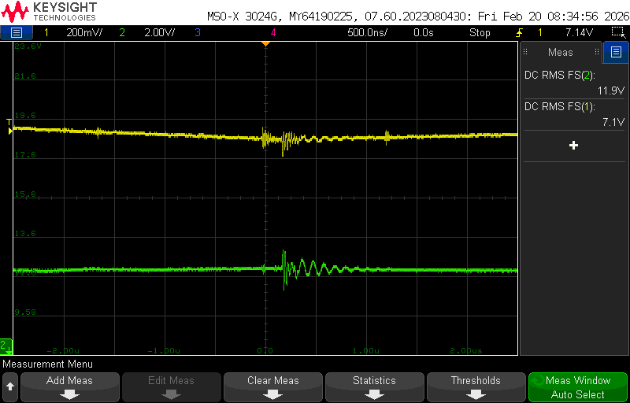
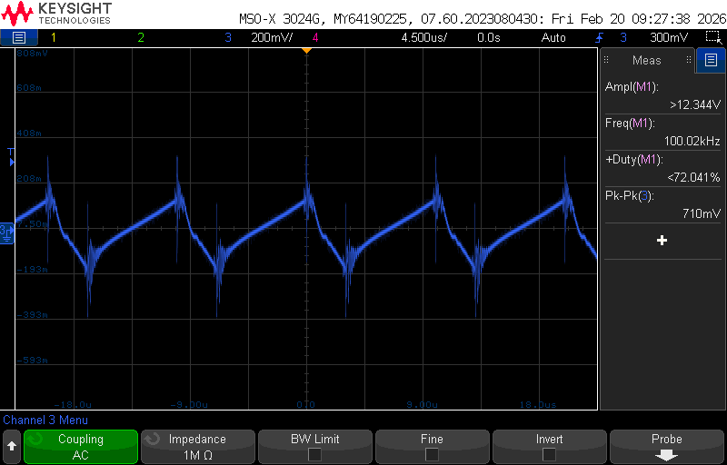

# Lab Entry – 2026-02-21

## Metadata
- Date: 2026-02-21
- Project: Off Grid Solar Battery Charger
- Board / Rev: 
- Scope: Test Buck Converter

## Objective
Verify that the buck converter steps down voltage. Measure efficiency, output and output ripple. 

## Setup
<figure>

<figcaption>Figure 1 - Ch 1 supplies the Gate Drive IC. Ch 2 is input to the Buck Converter </figcaption>
</figure>

<figure>

<figcaption> Figure 2 - HIL setup for the Buck Converter </figcaption>
</figure>

Parameters/Intial Conditions:
- Vin to buck is 12 v
- Duty Cycle is .6
- Switching frequency is 100 KHz
- Rload is 100 ohms
- inductor is 140 µH
- $C_{out}$ is 33 µF

## Measurements
Looking at Figure 2, We are measuring VGS of the MOSFET, and Vout across the 100 ohm resistor. We are also using a Multimeter not seen in Figure 2 to measure the currrent through the laod resistor. 

<u> Use these equations to compare HIL test results:</u>

- $V_{out} = D \times V_{in}$ (Eq1)
- $\Delta I = \frac{(V_{in}-V_{out})*D}{Lf_s}$ (Eq 2)
- $\Delta V_{out} = \frac{\Delta I}{8f_{s}C_{out}}$ (Eq 3)
- $\eta = \frac{P_{out}}{P{in}} \times 100$ 

## Scope Captures
<figure>

<figcaption> Figure 3- Ch2 is voltage into buck converter. Ch 1 is the voltage across the load of the buck converter. Duty Cycle is 60%</figcaption>
</figure>

<figure>

<figcaption> Figure 4 - M1 is VGS voltage. Ch3 is the meausred output ripple</figcaption>
</figure>
Note that Figure 4 measure peak to peak at 710 mV, but if we ignore transients it's closer to 400 mV peak to peak. 

## Observations
Using Eq 1, and looking at Figure 3, we would expect:

$V{out} = 7.2 V$

We measured:
$V_{out} = 7.1 V$

This is very close to theoretical ideal case. 

Using Eq 2 and Eq3, wed expect the following and parameters defined in setup: 
$\Delta I \approx 207 mA$
$\Delta V_{out} \approx 7.79 mV$

Looking at Figure 4, we can see our output ripple voltage is 710 mV, but ignoring transients its closer to 400 mV peak to peak. 

Regarless, this is way different than what we'd expect.

I ran a few more test at different duty cycels, but the test had a lot of noise, and appeared to be operating in DCM. Therefore I stopped the Test and decided to not inculde the remaing measurements here. 

## Conclusions / Next Steps
Although this test did not go as expected, I learned the importance of layout and mitigating EMI. I also learned that bread boards are not sufficient at running HIL test for Switch mode power supplies. 

My next step is to do some research on building a modular PCB design to help mitigate some of noise, and allow for incorparating the linear lead acid battery charger if i cant get the firmware to work with a single buck converter to battery. 