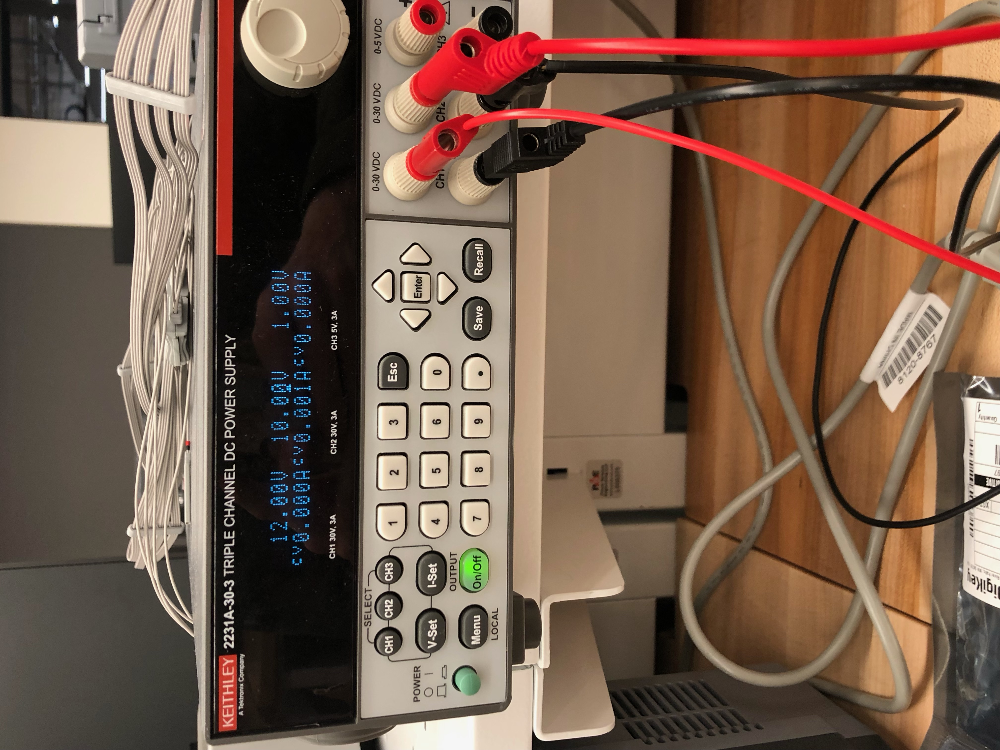
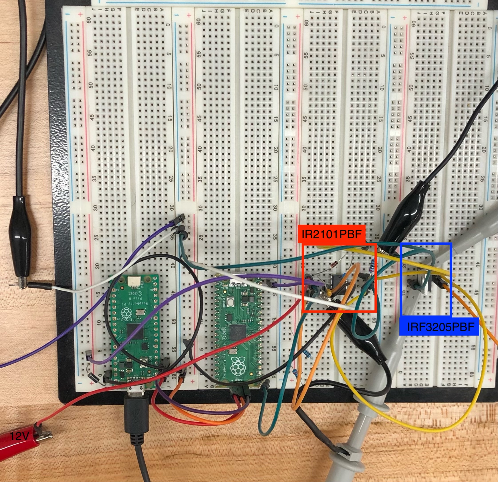
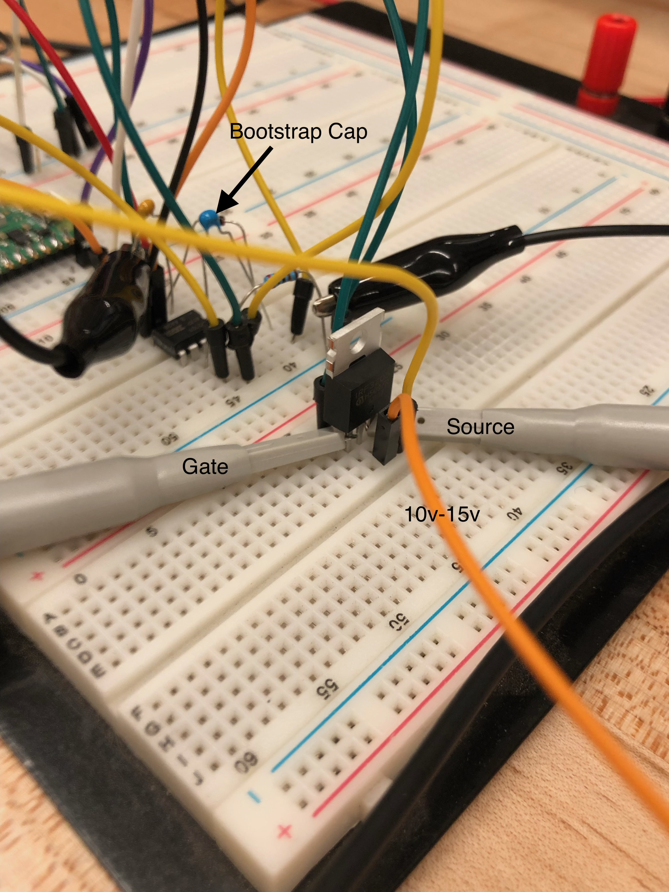
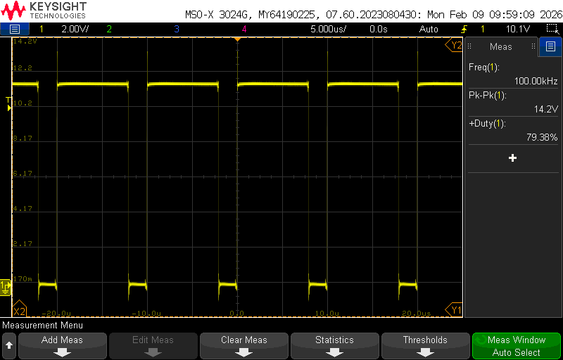
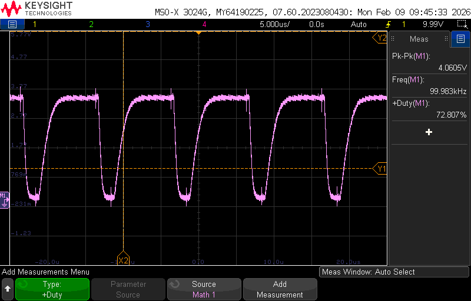

# Lab Entry – 2026-02-08

## Metadata
- Date: 2026-02-08
- Project: Off Grid Solar Battery Charger
- Board / Rev: Raspberry Pi Pico
- IC: IR2101PBF
- Scope: Verify that the IR2101PBF and suppourting componets outputs a higher voltage pwm than pico, but still meet 100 KHz frequency and the output is clean. 
  

## Objective
- Test the IR2101PBF IC and supporting componets. Send a PWM to the IC and verify its output is higher voltage at correct frequency. 
- Verify the pwm is clean ( no noise). 
- Verify that boostrap cap elevates the gate voltage 4v higher than the source voltage. 

## Setup
<figure>
  
  <figcaption> Figure 1: Ch1 supplies the IC, Ch2 supplies the Mosfet Drain</figcaption>
</figure>

<figure>
  
  <figcaption> Figure 2: HIL Set up for the IR2101PBF. /figcaption>
</figure>

IR2101PBF Suppourting componets:
- cap from Vs to com: 100 nF
- cap from Vb to Vs(boostrap cap): 220 nF
- Diode (Dboot): 1N4148TR 

<figure>
  
  <figcaption> Figure 3: HIL Set up for the IR2101PBF plus Mosfet. </figcaption>
</figure>

## Scope Captures
<figure>
  
  <figcaption> Figure 4: IR2101PBF HO output with no Mosfet connected </figcaption>
</figure>

<figure>
  
  <figcaption> Figure 5: Mosfet Gate Source Differential Output</figcaption>
</figure>

## Observations
Looking at Figure 4, we can see that the gate drive output achieved a higher amplitude, frequency is 100KHz and duty cycle was set to 80%.The signal was a little noisy, but should be suffcient.  

Looking at Figure 5m we can see that the differential signal from Drain to source is greater than or equal to 4v. The frequency is 99.983 KHz, and our duty cycle was set to 70%. The signal is a little noisy, but should be suffcient. 

## Conclusions / Next Steps
The half bridge gate drive IC and suppourting componets satisfied the objective. 

VGS is not as high as I would like, and the rolled edges are not ideal. 

Next step is to set up a low side mosfet and a new Resistor load value of 100 ohms instead of 2 Kohms.The low side mosfet will help reset cboot and allow it to charge fully, and thus create higher VGS value and better conductions. 